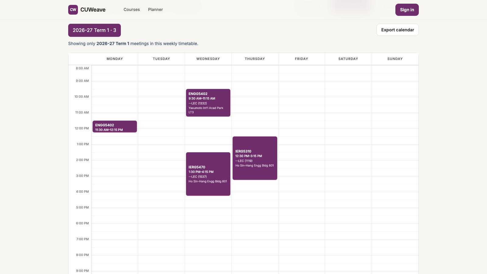
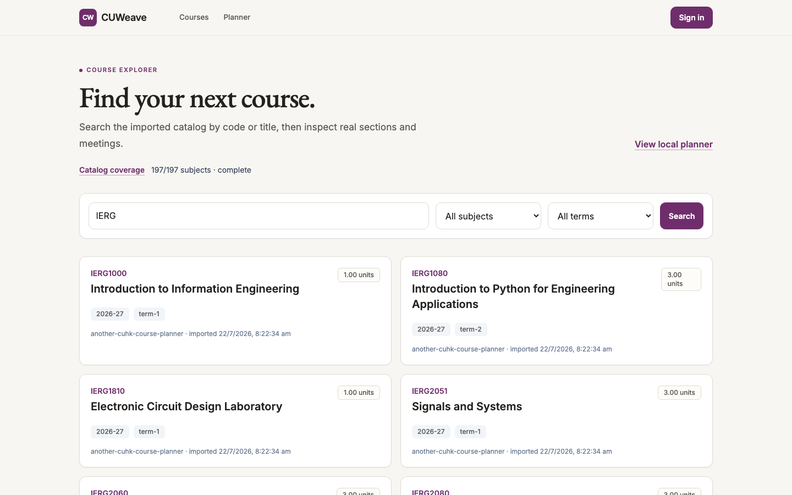
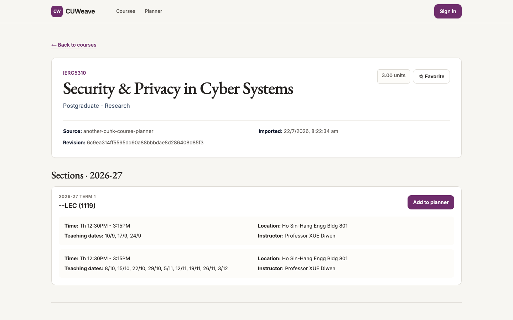
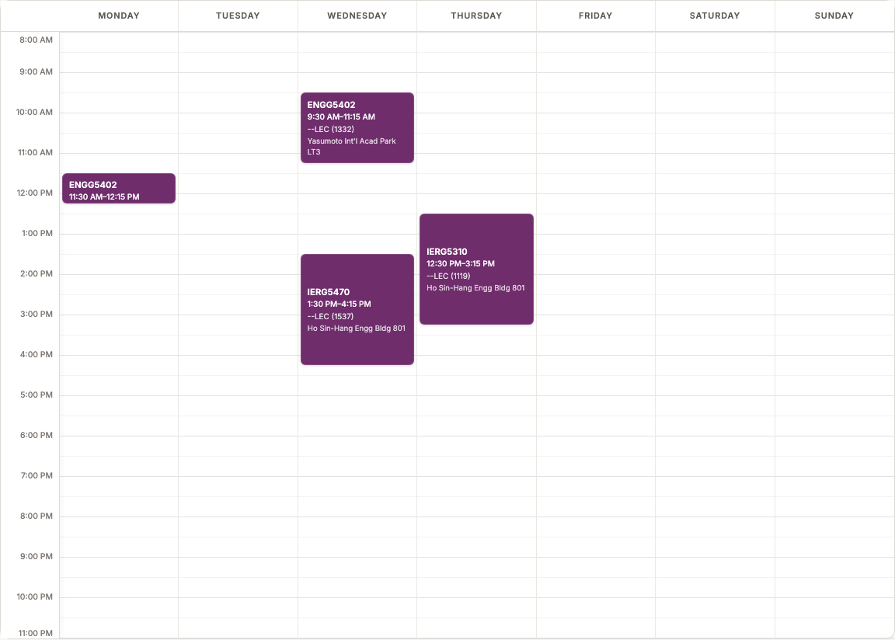

<div align="center">

# CUWeave

### Explore courses. Plan your schedule. Share experiences.

CUWeave helps CUHK students discover courses, build weekly timetables, save different plans, and
learn from other students’ experiences—all in one place.

**[Try CUWeave](https://cuweave.org)** ·
[Report an issue](https://github.com/qinchonghanzuibang/CUWeave/issues) ·
[Contribute](#contributing)

</div>

<!--
Demo video replacement:
- Keep docs/assets/readme/demo-cover.png as the poster image.
- Replace only the anchor href below with the final public demo-video URL.
- Recommended video: 1600 × 900, 45–60 seconds, following docs/readme-media-guide.md.
-->
<a href="https://cuweave.org">
  
</a>

<p align="center">
  <sub>A real signed-out planner view from the public application. Course details remain connected to every meeting.</sub>
</p>

> CUWeave is an unofficial, student-led project. It is not affiliated with or endorsed by The
> Chinese University of Hong Kong. Always verify final course and enrollment details in CUSIS.

## One place for the decisions around your timetable

<table>
  <tr>
    <td width="33%" valign="top">
      <h3>Explore courses</h3>
      Search by course code or title, filter by subject and term, and compare offerings, sections,
      meetings, instructors, and teaching dates together.
    </td>
    <td width="33%" valign="top">
      <h3>Plan your schedule</h3>
      Add real sections to a Monday–Sunday weekly timetable, move between academic terms, spot
      confirmed or uncertain conflicts, and export a calendar.
    </td>
    <td width="33%" valign="top">
      <h3>Share experiences</h3>
      Read structured experiences tied to a course offering or instructor. Eligible students can
      sign in to contribute, vote, and report concerns.
    </td>
  </tr>
</table>

## See CUWeave in action

<table>
  <tr>
    <td width="50%" valign="top">
      
      <p align="center"><sub>Search the current catalog and narrow it by subject or term.</sub></p>
    </td>
    <td width="50%" valign="top">
      
      <p align="center"><sub>Inspect a section in context, then add it directly to the planner.</sub></p>
    </td>
  </tr>
</table>



<p align="center">
  <sub>Compare a coherent week at a glance. Meeting cards use current public course data.</sub>
</p>

## Why CUWeave

- **One connected workflow.** Move from search to section details to a weekly plan without
  rebuilding the same context in separate tools.
- **Made for CUHK course structure.** Offerings, sections, meeting patterns, teaching dates, and
  instructors stay visible where they matter.
- **Plans stay useful.** Anonymous choices remain in the browser; signed-in students can keep
  private named schedules and create revocable read-only share links.
- **Source context stays visible.** Catalog coverage, import time, and source revision are available
  alongside course information.

## Available now

CUWeave is publicly available at **[cuweave.org](https://cuweave.org)**. The live catalog currently
reports complete 2026–27 manifest coverage across **197 of 197 subjects**; see the always-current
[data status page](https://cuweave.org/data-status) for course, offering, and section counts.

Course discovery and the local planner work without an account. Private favorites, named cloud
schedules, read-only sharing, and review contributions require a one-time code sent to an exact
`@link.cuhk.edu.hk` address. Requirement checking is not part of the current public release; it is a
possible future roadmap item.

CUWeave does not replace CUSIS or official CUHK materials. Confirm enrollment availability, times,
venues, teaching dates, and academic decisions with the university’s authoritative systems.

## Trust and privacy

- CUWeave never asks for a OnePass password, student ID, legal name, or transcript.
- Anonymous planner choices stay in the current browser unless the student chooses to sign in and
  save a private cloud copy.
- Public anonymous reviews do not expose the author’s account identity.
- Course pages retain visible source and update context, and corrections can be reported without
  including private student information.

Read the current [Privacy Policy](https://cuweave.org/privacy),
[Terms of Use](https://cuweave.org/terms),
[Community Guidelines](https://cuweave.org/community-guidelines), and
[Review and Moderation Policy](https://cuweave.org/moderation-policy).

## Open-source project

[](https://github.com/qinchonghanzuibang/CUWeave/actions/workflows/ci.yml)
[](LICENSE)

CUWeave is a TypeScript and Python monorepo built with Next.js, React, Tailwind CSS, PostgreSQL,
Drizzle ORM, Better Auth, Pydantic, and Psycopg. Vitest, pytest, Playwright, Ruff, and GitHub Actions
cover application and data-pipeline quality.

<details>
<summary><strong>Run CUWeave locally</strong></summary>

### Requirements

- Node.js 22+
- pnpm 11+
- Python 3.12+ and uv
- Docker Compose

### Setup

```bash
cp .env.example .env
pnpm install --frozen-lockfile
(cd services/ingest && uv sync --frozen)

pnpm db:up
pnpm db:migrate
pnpm ingest import tests/fixtures/synthetic-subject.json \
  --manifest tests/fixtures/synthetic-manifest.json
pnpm dev:seed
pnpm dev
```

Open [http://localhost:3000](http://localhost:3000). The local setup uses synthetic fixtures; real
academic JSON is not committed or fetched automatically. See the
[local import guide](docs/upstream/importing.md) for the pinned-source validation and import
workflow.

Run the standard project checks with:

```bash
pnpm check
```

</details>

### Contributing

Contributions that improve accuracy, accessibility, privacy, or student usefulness are welcome.
Please read [CONTRIBUTING.md](CONTRIBUTING.md) before opening a change. The
[README media guide](docs/readme-media-guide.md) documents how to refresh screenshots and record a
demo without exposing personal information.

Report security vulnerabilities privately by following [SECURITY.md](SECURITY.md), not through a
public issue.

### Documentation and policies

- [Architecture overview](docs/architecture/overview.md)
- [Product principles](docs/product/principles.md)
- [Planner semantics](docs/product/planner-semantics.md)
- [Accounts and privacy](docs/product/accounts-and-privacy.md)
- [Reviews and moderation](docs/product/reviews-and-moderation.md)
- [Importing and provenance](docs/upstream/importing.md)
- [Deployment and operations](docs/operations/deployment.md)

### License and acknowledgements

CUWeave source code is licensed under the
[GNU Affero General Public License v3.0 only](LICENSE). Academic data, university materials, names,
and third-party projects remain subject to their own rights and licenses.
[THIRD_PARTY_NOTICES.md](THIRD_PARTY_NOTICES.md) records the audited references and notices; review
of another project does not mean its code, assets, fixtures, or academic data were incorporated
into CUWeave.
